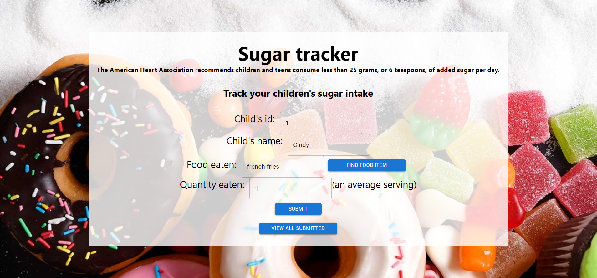
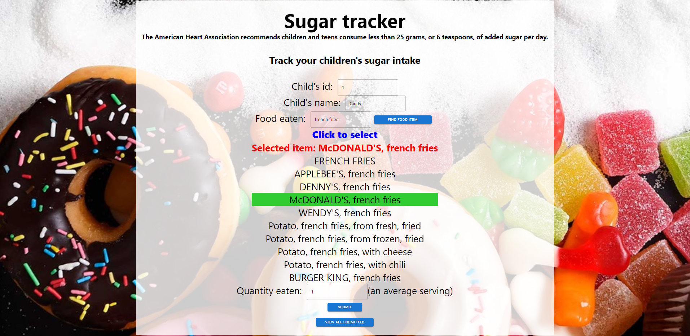
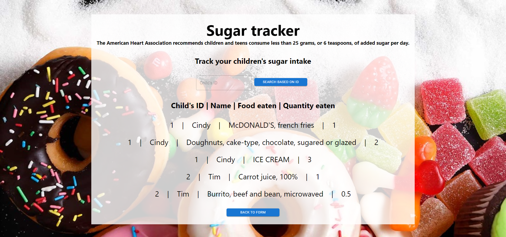
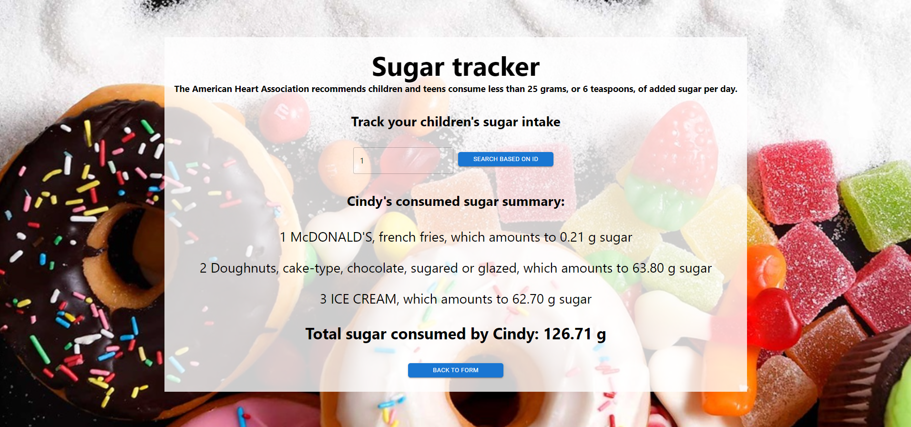

# Sugar tracker application
This sugar tracker application is for new parents, early childhood educators, child care takers, or anyone who takes care of young kids, and wants to keep track of the child's/children's sugar intake.

  

<h3 align="center">
  Sugar tracker main page designed with React.js  
</h2>
 

  

<h3 align="center">
  Search the food API for a specific item  
</h2>
 

  

<h3 align="center">
  View all entries made for each child  
</h2>
 

  

<h3 align="center">
  View a specific child's food intake and total sugar consumed  
</h2>
 

# Tech stack
- Frontend: React, Material UI, CSS
- Backend: Node.js, Express.js, MongoDB

# How to run application

- Set up variables in .env file
    - Optional: I already included my API key for your use, but you can get an API key from https://fdc.nal.usda.gov/api-key-signup.html (They will email you the API key right away). Then put your API key between the quotation marks of `API_KEY`.
    - Optional: I already included my MongoDB string connection for your use, but you can also create your own MongoDB string connection and replace `DB_STRING`. When you use the application, the database name will be "dataSchema" and the collection name will be "childrendatas".
- Set up and run frontend in one terminal window
    - cd CSFIntershipAssessment2023/client
    - npm install (to install all dependencies)
    - npm start
- Set up and run backend in another terminal window
    - cd CSFIntershipAssessment2023/server
    - npm install (to install all dependencies)
    - nodemon appServer.js

# Bonus Points

## Discuss how the application and api could be extended and improved
There are many ways this application and API could be extended and improved:
- Give an in-app warning and email warning notification that a child is approaching the daily sugar limit
- Add login/logout, authentication features
- Add links on where to get help and support for managing sugar levels
- Make application responsive and mobile-friendly
- Add error checking, error notification if item not found
- Add a delete option
- Add date eaten
- The list of items sometimes repeats because the "description" of the API of the item is displayed. It would be better if items don't appear to repeat. Could add more API fields to them, such as including "brandName".
- Add more user feedback (e.g. when submit button is clicked)

## Discuss how the application and api should be deployed
- According to [this article](https://niruhan.medium.com/deploying-mern-fullstack-application-on-the-web-for-free-with-netlify-and-heroku-87d888012635), the application and API can be deployed with the following:
    - MongoDB Atlas for MongoDB
    - Heroku for the node server
    - Netlify for the React front end

## Intuitive design and user interface
Some design features I included in the sugar tracker application:
- Have a clutter-free homepage
- Input textboxes have placeholder instructions
- Visually appealing background, which doesn't hinder visibility of text
- Selecting food item from the list has a green highlighted background for user feedback
- Both "View all submitted" and "specific ID" page have text to communicate what the page is about