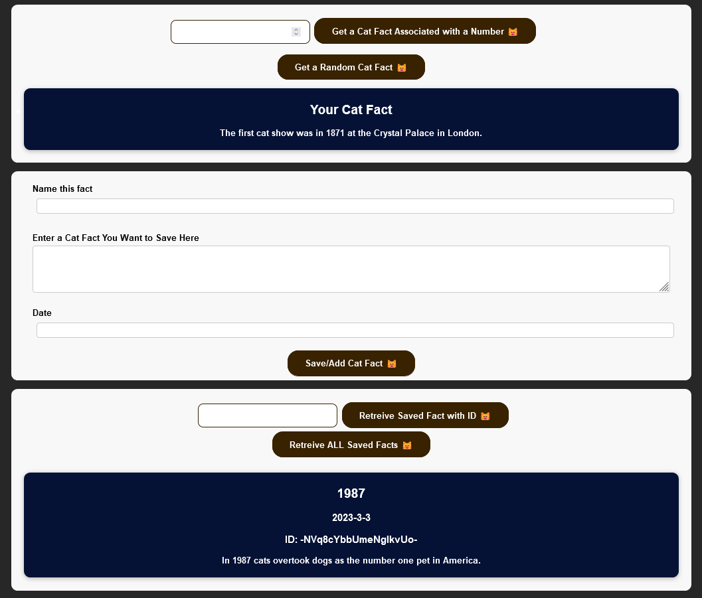

## Cat Facts API + Web App

This is a web app that gets cat facts from this public API: https://github.com/wh-iterabb-it/meowfacts. 

Then you can save the a fact to a realtime Firebase database with a: name of the fact, the fact, and the date.

Then you can retrieve a specific fact by an ID, or get all the facts save to the Firebase database at once.

To use the web app follow the instructions:

1. This web app uses ReactJS and NodeJS. Please download the latest version of NodeJS.
2. Copy the cat-fact-API-app folder and everything inside into onto your computer/working environment.
3. Inside the cat-fact-API-app folder, run "npm install" to download all the necessary dependencies. If needed, run "npm audit fix --force" to fix broken dependencies.
4. Run "npm start" to get the app running.

The web app should be running and look something like: 

In the first section, you can get facts from the public API. The public API only takes positive whole numbers as IDs for specific cat facts. Or you can get a random cat fact.

In the second section, you can save (POST) a fact to a a firebase database - simply fill in the fields.

In the third section, you can retrieve cat facts that are saved to the database. I saved one fact to the database already with ID: -NVq8cYbbUmeNglkvUo-.
Feel free to retrieve that fact by inserting that ID into the text field and clicking the button beside it. If you want to get another specific fact, fill the text field with the appropriate ID.
You can also get all the facts saved to the database at once.
